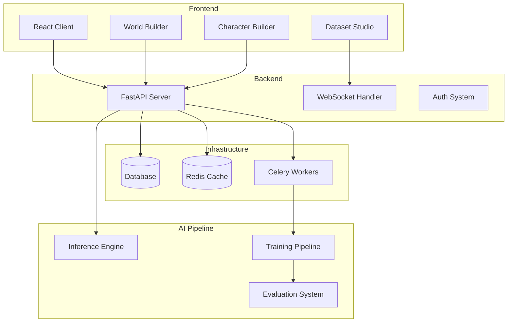

# Character Creation Devkit

A comprehensive platform for creating, training, and deploying AI characters with persistent personalities and memory.

## 🆕 New Architecture (v2.0)

We've migrated from Streamlit to a modern, production-ready stack:

<div style={{background: 'linear-gradient(135deg, #667eea 0%, #764ba2 100%)', padding: '2rem', borderRadius: '12px', color: 'white', marginBottom: '2rem'}}>
  <h3 style={{marginTop: 0}}>Modern Tech Stack</h3>
  <ul style={{marginBottom: 0}}>
    <li><strong>Frontend</strong>: React with TypeScript, Tailwind CSS</li>
    <li><strong>Backend</strong>: FastAPI with async/await throughout</li>
    <li><strong>Real-time</strong>: WebSocket support for live updates</li>
    <li><strong>Task Queue</strong>: Celery with Redis for async operations</li>
    <li><strong>Database</strong>: SQLAlchemy with SQLite/PostgreSQL</li>
    <li><strong>Caching</strong>: Redis for performance optimization</li>
  </ul>
</div>

## Core Concepts

The platform is built on these key principles:

- **Devkit + Cartridge Architecture**: A creative suite for designing characters and worlds that exports self-contained "cartridges" for runtime use
- **Structured Authoring**: Define character psychology using the Big Five personality model, goals, relationships, and memories
- **Emergent Narrative**: Characters with consistent internal motivations enable unique story interactions
- **Triple-Head Architecture**: Model generates text, control tokens for UI/emotional state, and memory vectors for persistence

## Getting Started

Follow these guides in order:

1. **[Setup Guide](./setup-guide.md)**: Install and configure the platform
2. **[Getting Started](./getting-started.md)**: Create and train your first character
3. **[Training Guide](./training-guide.md)**: Deep dive into SFT and RLHF training pipelines
4. **[🌊 Diffusion Training Wizard](./diffusion-training-wizard.md)**: NEW! Multimodal diffusion model training
5. **[Client Guide](./client-guide.md)**: Use the production client for character interactions

## Documentation Structure

- **Getting Started**: Setup and tutorial guides
- **Core Documentation**: Architecture, concepts, and features
- **Advanced**: Specialized topics for developers

## Platform Architecture

### Overview

The platform consists of four main components:



### Key Features

**Character Creation**
- AI-guided character discovery through natural conversation
- Interactive Big Five personality trait visualization
- World integration for character consistency
- Real-time character synthesis and analysis

**World Building**
- Structured world creation with settings, rules, history, cultures, and locations
- Dynamic rule system for physics, magic, and technology
- Culture and location management with rich descriptions
- World-character integration for consistency

**Dataset Generation**
- Real-time progress tracking with WebSocket updates
- Configurable generation parameters (temperature, batch size, quality modes)
- Topic-based conversation generation
- Interactive quality control and curation

**Training Pipeline**
- Supervised Fine-Tuning (SFT) for initial character voice training
- Reinforcement Learning (RLHF) for preference-based alignment
- Live training dashboards with pause/resume controls
- Personality alignment and lore adherence metrics

**Production Inference**
- Optimized for real-time character interactions
- Hot-swappable adapters for character switching
- Session persistence across conversations
- Scalable architecture for multiple concurrent users

## Quick Setup

```bash
# Launch everything with Docker
./start-devkit.sh

# Or run components separately:
cd backend && uvicorn app.main:app --reload   # Backend API
cd client && npm start                         # React Client
docker run -d redis:alpine                     # Redis
celery -A backend.app.celery_app worker       # Celery Worker
```

## API Endpoints

The new FastAPI backend provides comprehensive REST APIs:

- **Authentication**: `/api/v1/auth/*` - User registration, login, JWT tokens
- **Worlds**: `/api/v1/worlds/*` - CRUD operations for world management
- **Characters**: `/api/v1/characters/*` - Character creation and management
- **Datasets**: `/api/v1/datasets/*` - Dataset generation with WebSocket progress
- **Training**: `/api/v1/training/*` - Training job management
- **Inference**: `/api/v1/inference/*` - Character chat and interaction

## Technology Highlights

### Frontend Excellence
- **React 18** with TypeScript for type safety
- **Tailwind CSS** with custom design system
- **Real-time updates** via WebSocket
- **Responsive design** for all screen sizes
- **Beautiful animations** with Framer Motion

### Backend Power
- **FastAPI** for high-performance async APIs
- **SQLAlchemy 2.0** with async support
- **Redis** for caching and pub/sub
- **Celery** for distributed task processing
- **JWT authentication** with refresh tokens

### DevOps Ready
- **Docker** containers for all services
- **Docker Compose** for local development
- **GitHub Actions** for CI/CD
- **Comprehensive test coverage**
- **Production-ready configurations**

## Migration from v1.0

If you're coming from the Streamlit-based v1.0:

1. **Data Migration**: Use the provided migration scripts to move your data
2. **API Integration**: New REST APIs replace Streamlit's state management
3. **UI Improvements**: Enjoy the responsive, modern React interface
4. **Performance**: Experience 5-10x faster response times

## Current Status

- ✅ Ring 1: Devkit Complete
- ✅ Ring 2: Runtime Packets  
- ✅ Ring 3: Multi-User Platform
- ✅ Ring 4: Production Inference
- 🆕 Ring 5: Modern Web Platform (NEW!)
- 🔄 Ring 6: TTS/STT Integration (Coming Soon)

## Getting Help

- **GitHub Issues**: Report bugs or request features
- **API Documentation**: Available at `/docs` when running the backend
- **Discord Community**: Join our community for support

[Get Started](./setup-guide) | [Core Concepts](./core-concepts) | [API Reference](/api/docs) 