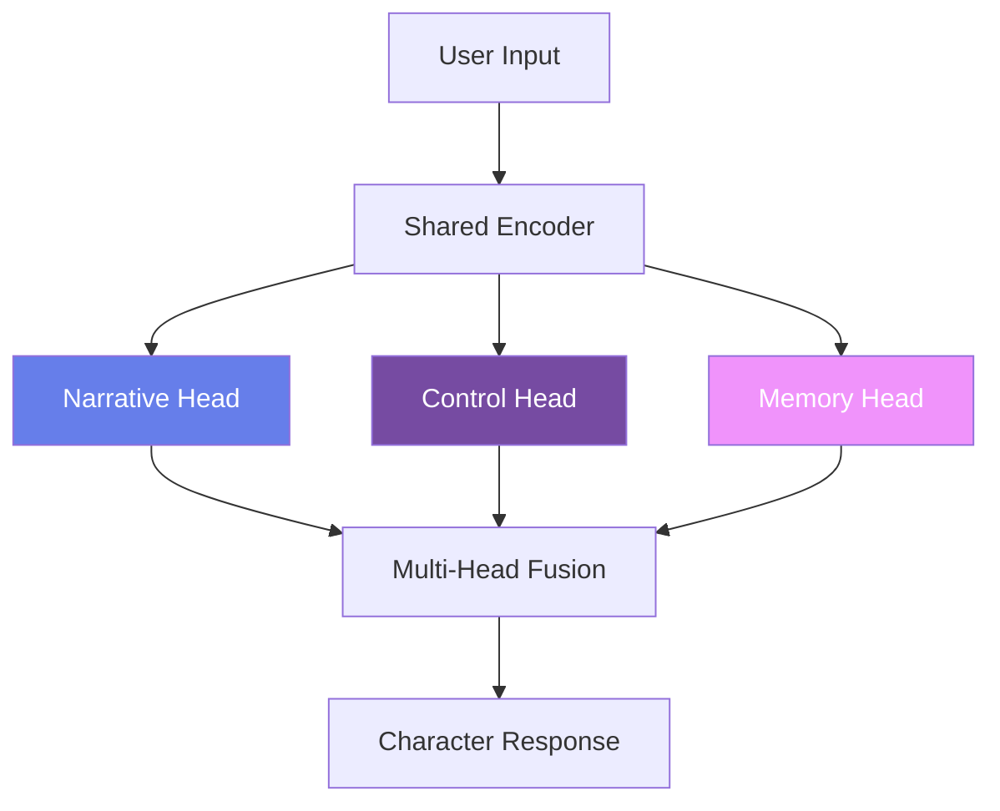
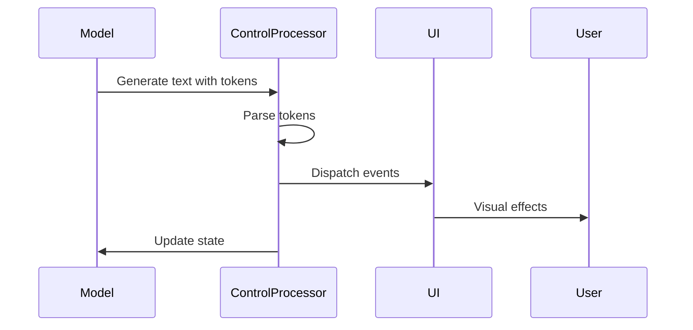
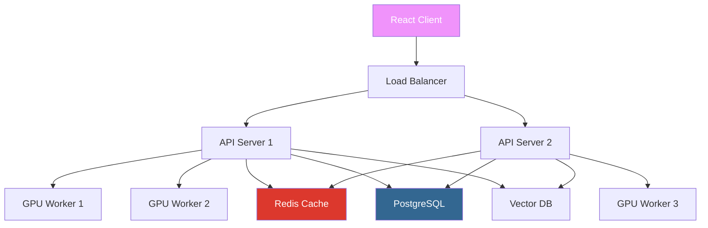

# Core Concepts

Understanding the architecture and key concepts behind the Character Creation Platform will help you create more compelling characters and use the platform more effectively.

<div style={{background: 'linear-gradient(135deg, #667eea 0%, #764ba2 100%)', padding: '2rem', borderRadius: '12px', color: 'white', marginBottom: '2rem'}}>
  <h2 style={{marginTop: 0}}>Platform Architecture</h2>
  <p>Our platform is built on cutting-edge AI technology with a focus on:</p>
  <ul style={{marginBottom: 0}}>
    <li>Triple-head Narrative-LLM architecture</li>
    <li>Memory-augmented generation</li>
    <li>Control token orchestration</li>
    <li>Real-time emotion modeling</li>
    <li>Production-grade inference optimization</li>
  </ul>
</div>

## The Triple-Head Architecture

Our revolutionary model architecture enables characters that truly understand narrative, personality, and memory:



### Narrative Head
Responsible for:
- Story coherence and progression
- Character voice and personality
- World consistency
- Emotional expression

### Control Head
Manages:
- UI commands and effects
- Emotion state transitions
- Memory formation triggers
- Meta-narrative elements

### Memory Head
Handles:
- Long-term memory encoding
- Memory retrieval and relevance
- Emotional memory weighting
- Session persistence

## Memory System

Our advanced memory system gives characters persistent, emotionally-weighted memories:

### Memory Types

<div style={{display: 'grid', gridTemplateColumns: 'repeat(3, 1fr)', gap: '1rem', marginBottom: '1rem'}}>
  :::tip[Episodic Memory]
  <div>
    <p>Specific events and conversations</p>
    <ul>
      <li>User preferences</li>
      <li>Shared experiences</li>
      <li>Important moments</li>
    </ul>
  </div>
  :::
  :::info[Semantic Memory]
  <div>
    <p>Facts and knowledge</p>
    <ul>
      <li>World lore</li>
      <li>Character relationships</li>
      <li>Learned information</li>
    </ul>
  </div>
  :::
  :::warning[Emotional Memory]
  <div>
    <p>Feelings and associations</p>
    <ul>
      <li>Emotional context</li>
      <li>Trust levels</li>
      <li>Relationship dynamics</li>
    </ul>
  </div>
  :::
</div>

### Memory Formation Process

```python
memory_pipeline = {
    "1_detection": "Identify important moments",
    "2_encoding": "Create memory vector (768D)",
    "3_weighting": "Apply importance scores",
    "4_storage": "Store in vector database",
    "5_decay": "Apply time-based decay"
}
```

### Memory Metadata

Each memory stores:
- **Importance Score** (0.0-1.0): How significant the memory is
- **Emotional Valence** (-1.0 to 1.0): Positive/negative emotion
- **Context Relevance** (0.0-1.0): How relevant to current conversation
- **Decay Rate** (0.0-1.0): How quickly memory fades
- **Timestamp**: When memory was formed

## Control Token System

Control tokens enable dynamic UI interactions and character state management:

### Token Categories

| Category | Examples | Purpose |
|----------|----------|---------|
| **Emotion** | `<happy>`, `<sad>`, `<angry>` | Trigger emotion changes |
| **Action** | `<thinking>`, `<memory>`, `<pause>` | UI effects and timing |
| **Meta** | `<scene>`, `<chapter>`, `<end>` | Narrative structure |
| **System** | `<save>`, `<load>`, `<switch>` | Platform commands |

### Token Processing Flow



## Character Definition Structure

Characters are defined by multiple interconnected layers:

### Core Identity
```typescript
interface CharacterCore {
  name: string;
  age: number;
  gender: string;
  species: string;
  occupation: string;
  tagline: string;
}
```

### Personality Model
Based on Big Five personality traits:

```typescript
interface Personality {
  openness: number;        // 0.0-1.0
  conscientiousness: number;
  extraversion: number;
  agreeableness: number;
  neuroticism: number;
  
  traits: string[];        // ["brave", "curious", ...]
  quirks: string[];        // ["taps fingers", "says 'indeed'", ...]
}
```

### Background & Relationships
```typescript
interface Background {
  origin: string;
  history: string[];
  goals: string[];
  fears: string[];
  relationships: {
    [character: string]: {
      type: "friend" | "rival" | "family" | "romantic";
      description: string;
      trust_level: number;
    }
  };
}
```

## Training Pipeline

Our training process ensures characters maintain consistency while being engaging:

### Stage 1: Supervised Fine-Tuning (SFT)
- **Input**: Character definition + conversation examples
- **Process**: Fine-tune base model on character-specific data
- **Output**: Character-aligned model

### Stage 2: Reinforcement Learning (RLHF)
- **Input**: Preference pairs from human feedback
- **Process**: Optimize for preferred behaviors
- **Output**: Refined character model

### Quality Metrics

:::note
We track multiple quality dimensions:

1. **Personality Alignment** (PA Score)
   - Measures Big Five trait consistency
   - Target: >0.75

2. **Lore Adherence** (LA Score)
   - Checks world fact accuracy
   - Target: >0.85

3. **Emotional Coherence** (EC Score)
   - Validates emotion transitions
   - Target: >0.80

4. **Response Quality** (RQ Score)
   - Overall generation quality
   - Target: >0.70
:::

## Inference Optimization

Our production inference engine is designed for responsive real-time interactions through:

- **Request Queueing**: Manages multiple incoming requests efficiently
- **Attention Caching**: Reduces redundant computation
- **GPU Memory Management**: Automatic optimization and recovery
- **Adapter Hot-Swapping**: Change characters without server restart

## Session Management

Each conversation session maintains:

### Session State
```typescript
interface SessionState {
  session_id: string;
  character_id: string;
  emotional_state: EmotionVector;
  active_memories: Memory[];
  conversation_history: Message[];
  context_window: string[];
}
```

### Emotion Vector
Characters track emotions on multiple dimensions:

```typescript
interface EmotionVector {
  happiness: number;    // 0.0-1.0
  sadness: number;
  anger: number;
  fear: number;
  surprise: number;
  disgust: number;
  trust: number;
  anticipation: number;
}
```

## UI Integration

The React client integrates deeply with our inference engine:

### Real-Time Updates
- WebSocket connections for instant responses
- Server-Sent Events for emotion updates
- Optimistic UI updates

### Visual Feedback
- Emotion-driven color gradients
- Memory formation animations
- Control token visual effects

### Mobile Optimization
- Progressive enhancement
- Reduced payload packets
- Offline-first architecture

## Security & Privacy

### Data Protection
- End-to-end encryption for sensitive data
- Session isolation
- Memory access controls

### Content Safety
- Built-in content filtering
- Character behavior boundaries
- User-defined safety levels

## Deployment Architecture



## Best Practices

### Character Design
1. **Start with strong personality traits**
2. **Build consistent world lore**
3. **Define clear relationships**
4. **Create memorable quirks**
5. **Establish goals and motivations**

### Training Optimization
1. **Quality over quantity for data**
2. **Diverse conversation scenarios**
3. **Regular validation during training**
4. **Incremental improvements**
5. **Test edge cases thoroughly**

### Production Deployment
1. **Monitor latency metrics**
2. **Scale based on concurrent users**
3. **Cache frequently accessed data**
4. **Use CDN for static assets**
5. **Implement graceful degradation**

### Scaling Considerations

1. **Vertical Scaling**: Use more powerful GPUs for better throughput
2. **Horizontal Scaling**: Distribute load across multiple instances
3. **Session Affinity**: Keep users on the same server for consistency
4. **Memory Management**: Monitor and optimize GPU memory usage

---
:::tip[Master the Platform]
<div>
  <p>Understanding these core concepts will help you create amazing AI characters. Ready to dive deeper?</p>
  <a href="./advanced-features" style={{background: 'linear-gradient(135deg, #667eea 0%, #764ba2 100%)', color: 'white', padding: '0.75rem 2rem', borderRadius: '25px', textDecoration: 'none', display: 'inline-block', marginTop: '1rem'}}>
    <span style={{fontSize: '1.2rem'}}>Explore Advanced Features →</span>
  </a>
</div> 
:::