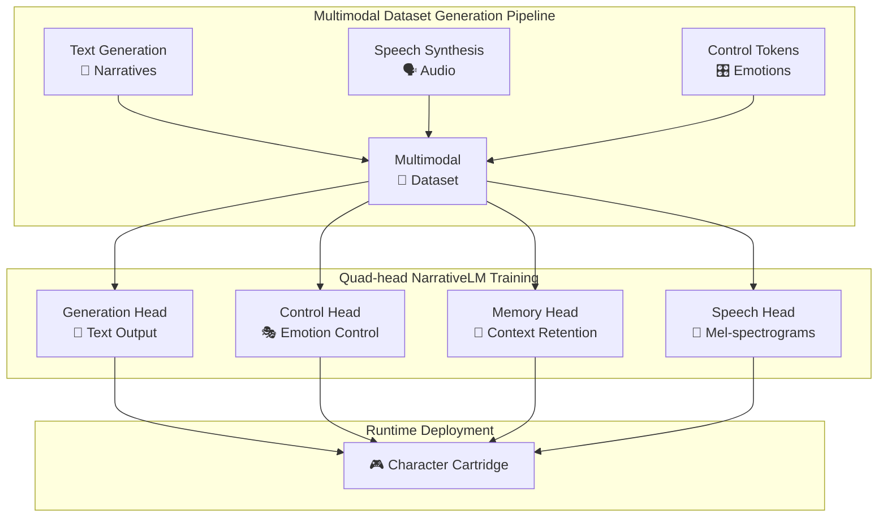
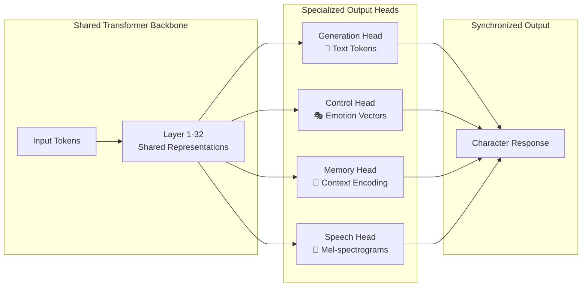
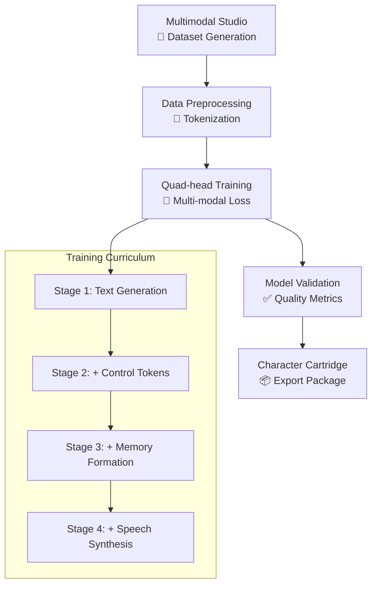

# Multimodal Studio Guide

> **Ring 6 Feature**: Generate synchronized text, audio, and control token datasets for advanced character training with the revolutionary Quad-head NarrativeLM architecture.

The Multimodal Studio is where creators generate training datasets that combine text, speech synthesis, and control tokens into a unified multimodal experience. This tool prepares data for the Quad-head NarrativeLM model that powers our next-generation character AI.

## Interface Overview

The Multimodal Studio features a clean, professional interface designed for creative workflows:

### **Configuration Tab** 
*The main workspace for setting up your multimodal dataset generation*

The configuration interface provides intuitive controls for:

**Generation Settings Section:**
- **Target Samples**: Numeric input (default: 1,000) - Sets the number of multimodal samples to generate
- **Character Count**: Numeric input (default: 10) - Defines how many diverse characters to include

**Narrative Types Grid:**
Visual cards for selecting content types, each with emoji icons and descriptions:
- 💬 **Dialogue** - Character conversations and interactions  
- 🎭 **Monologue** - Character inner thoughts and soliloquies
- ⚔️ **Action Scenes** - Dynamic, high-energy sequences
- 💖 **Emotional Moments** - Deep emotional expressions  
- 🧠 **Memory Recall** - Characters remembering past events
- 🌍 **World Description** - Environmental and lore exposition

**Voice Synthesis Controls:**
- **TTS Mode Toggle**: 
  - ⚡ **Mock TTS (Fast)** - Generate placeholder audio for rapid prototyping
  - 🎯 **Real TTS (Quality)** - Generate actual speech using TTS models

**Advanced Settings:**
- Batch Size slider (default: 10)
- Temperature control (default: 0.8) 

**Generation Summary:**
Real-time preview showing "1,000 Total Samples • 10 Characters • 3 Narrative Types • 10 Est. Minutes"

Large **🚀 Start Generation** button to begin the process.

## Quick Start Guide

### 1. **Configure Your Dataset**

```bash
# Navigate to Multimodal Studio
→ Creator Dashboard → 🎵 Multimodal Studio
```

**Set Your Parameters:**
- Adjust **Target Samples** based on your training needs (100-10,000)
- Choose **Character Count** for dataset diversity (5-50 recommended)
- Select multiple **Narrative Types** for varied content

### 2. **Choose Voice Synthesis Mode**

**For Rapid Prototyping:**
- Select **Mock TTS (Fast)** 
- Generate placeholder audio in minutes
- Perfect for testing and iteration

**For Production Quality:**
- Choose **Real TTS (Quality)**
- Select from TTS providers:
  - **Orpheus-TTS**: 3B parameter model with emotion tags
  - **XTTS**: Voice cloning with few samples  
  - **Bark**: Expressive speech with sound effects

### 3. **Monitor Generation Progress**

Switch to the **🔄 Jobs** tab to track:
- Real-time progress bars
- Current processing step
- Sample count and estimated completion
- Character context ("Generating speech for character: Nova-7")

## Architecture Overview



## Quad-head NarrativeLM Architecture

The Multimodal Studio generates training data for our revolutionary **Quad-head architecture**:



**Key Innovation**: All four modalities are trained simultaneously with a unified loss function, ensuring perfect synchronization between text, emotion, memory, and speech.

## TTS Provider Comparison

| Provider | Model Size | Strengths | Use Case |
|----------|------------|-----------|----------|
| **Orpheus-TTS** | 3B params | Emotion-aware synthesis | Character voices with emotional range |
| **XTTS** | Variable | Voice cloning | Custom character voices from samples |
| **Bark** | 1B params | Expressive effects | Dynamic scenes with sound effects |

## Dataset Quality Guidelines

### **Text Quality Indicators**
- Character consistency score > 85%
- Emotional coherence across samples
- Narrative flow and context retention

### **Audio Quality Metrics**  
- Clear pronunciation and articulation
- Appropriate emotional expression
- Consistent voice characteristics per character

### **Control Token Accuracy**
- Emotion classification confidence > 90%
- Memory importance scoring alignment
- Action/dialogue distinction clarity

## Best Practices

### **Planning Your Dataset**

**Start Small, Scale Up:**
```bash
Development: 100-500 samples
Testing: 1,000-2,000 samples  
Production: 5,000+ samples
```

**Character Diversity:**
- Include varied personality types
- Mix different emotional ranges
- Balance dialogue vs. narrative content

**Narrative Balance:**
- 40% Dialogue (conversations)
- 20% Monologue (inner thoughts)
- 15% Action Scenes (dynamic content)
- 15% Emotional Moments (character depth)
- 10% Memory/World Building

### **Iteration Strategy**

1. **Prototype** with Mock TTS for rapid testing
2. **Validate** content quality and character consistency  
3. **Generate** final dataset with Real TTS
4. **Train** Quad-head model with multimodal data
5. **Deploy** as Character Cartridge for runtime

## Training Pipeline Integration

The generated multimodal datasets integrate seamlessly with our training infrastructure:



## Troubleshooting

### **Common Issues**

**Generation Stalls:**
- Check available disk space (requires 2GB+ per 1000 samples)
- Verify TTS provider connectivity
- Reduce batch size for memory-constrained systems

**Audio Quality Issues:**
- Switch to higher-quality TTS provider
- Adjust temperature for more natural speech
- Verify character voice archetype compatibility  

**Character Inconsistency:**
- Increase character count for more diversity
- Add more dialogue samples for personality training
- Check narrative type balance

### **Performance Optimization**

**Speed Improvements:**
- Use Mock TTS for development/testing
- Increase batch size on powerful hardware
- Generate overnight for large datasets

**Quality Enhancements:**
- Use Real TTS with Orpheus provider
- Add manual character voice samples
- Include diverse emotional scenarios

## Advanced Features

### **Custom Character Voices**
Upload voice samples to create unique character voices with XTTS provider.

### **Batch Generation** 
Generate multiple datasets simultaneously for different character archetypes.

### **Quality Analytics**
Built-in metrics for evaluating dataset quality and character consistency.

---

## Next Steps

After generating your multimodal dataset:

1. **Review** in the Analysis tab for quality metrics
2. **Export** dataset for training pipeline
3. **Train** your Quad-head NarrativeLM model
4. **Deploy** as Character Cartridge for runtime

The Multimodal Studio transforms character creation from simple text generation into a comprehensive audiovisual experience, enabling the next generation of AI characters with synchronized speech, emotion, and memory capabilities.

---
:::tip[🎵 Create Amazing Voices!]
<div>
  <p>You're ready to create fully voiced AI characters with the Multimodal Studio. Start with Mock TTS to test your workflow, then move to real voice synthesis for production-quality results!</p>
  <a href="/creator/multimodal-studio" style={{background: 'linear-gradient(135deg, #9333ea 0%, #c084fc 100%)', color: 'white', padding: '0.75rem 2rem', borderRadius: '25px', textDecoration: 'none', display: 'inline-block', marginTop: '1rem'}}>
    <span style={{fontSize: '1.2rem'}}>Open Multimodal Studio →</span>
  </a>
</div>
::: 