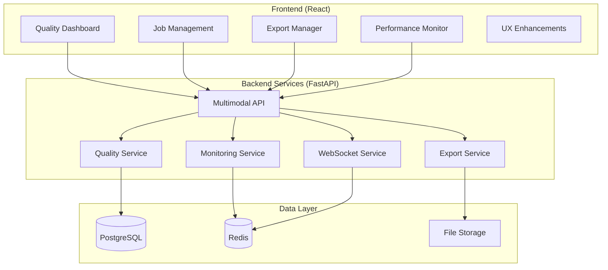

# Multimodal Studio Production Features - Technical Documentation

## Overview

The Multimodal Studio has been enhanced with enterprise-grade production features as part of Ring 6-9 development. This document provides comprehensive technical details for developers and system administrators.

## Architecture

### System Components



## API Endpoints

### Job Management API

#### Get Active Jobs
```http
GET /api/multimodal/jobs/active
```

**Response:**
```json
{
  "jobs": [
    {
      "id": "job-001",
      "dataset_id": "dataset-123",
      "status": "running",
      "progress": 65,
      "current_step": "Generating character dialogue",
      "priority": 1,
      "created_at": "2025-01-20T10:00:00Z",
      "estimated_completion": "2025-01-20T10:30:00Z",
      "metrics": {
        "samples_processed": 650,
        "samples_total": 1000,
        "processing_speed": "12.5 samples/sec",
        "cpu_usage": 0.75,
        "memory_usage": 0.60
      }
    }
  ]
}
```

#### Batch Job Operations
```http
POST /api/multimodal/jobs/batch-action
```

**Request Body:**
```json
{
  "action": "pause|resume|cancel|delete",
  "job_ids": ["job-001", "job-002", "job-003"]
}
```

**Response:**
```json
{
  "results": [
    {
      "job_id": "job-001",
      "success": true,
      "message": "Job paused successfully"
    },
    {
      "job_id": "job-002", 
      "success": false,
      "error": "Job not found"
    }
  ]
}
```

### Quality Validation API

#### Start Quality Validation
```http
POST /api/multimodal/datasets/{dataset_id}/validate
```

**Request Body:**
```json
{
  "validation_type": "full|quick|custom",
  "metrics": ["text_quality", "audio_quality", "character_consistency"],
  "thresholds": {
    "overall_quality": 0.8,
    "coherence": 0.75,
    "consistency": 0.85
  }
}
```

**Response:**
```json
{
  "validation_id": "val-001",
  "status": "started",
  "estimated_duration": "5-10 minutes"
}
```

#### Get Validation Results
```http
GET /api/multimodal/quality/validation-report/{validation_id}
```

**Response:**
```json
{
  "validation_id": "val-001",
  "dataset_id": "dataset-123",
  "status": "completed",
  "created_at": "2025-01-20T10:00:00Z",
  "completed_at": "2025-01-20T10:05:00Z",
  "metrics": {
    "overall_score": 0.87,
    "text_quality": {
      "coherence": 0.89,
      "fluency": 0.92,
      "relevance": 0.85,
      "diversity": 0.83
    },
    "audio_quality": {
      "clarity": 0.91,
      "naturalness": 0.88,
      "emotional_consistency": 0.86
    },
    "character_consistency": {
      "personality_alignment": 0.89,
      "voice_consistency": 0.87,
      "behavioral_consistency": 0.85
    }
  },
  "issues": [
    {
      "severity": "medium",
      "category": "text_quality",
      "message": "Some samples show inconsistent dialogue style",
      "affected_samples": 23,
      "suggestions": [
        "Review character voice guidelines",
        "Apply style consistency filters"
      ]
    }
  ],
  "suggestions": [
    {
      "id": "suggestion-001",
      "title": "Improve Dialogue Consistency",
      "priority": "high",
      "estimated_impact": "15% improvement in character consistency",
      "implementation_steps": [
        "Run style analysis on affected samples",
        "Apply character voice templates",
        "Re-validate improved samples"
      ]
    }
  ]
}
```

### Export Management API

#### Create Export Configuration
```http
POST /api/multimodal/exports/configs
```

**Request Body:**
```json
{
  "name": "HuggingFace Research Export",
  "format": "huggingface",
  "options": {
    "repository_name": "character-dialogue-dataset",
    "organization": "my-research-org",
    "license": "MIT",
    "generate_dataset_card": true,
    "include_metadata": true,
    "split_ratios": {
      "train": 0.8,
      "validation": 0.1,
      "test": 0.1
    }
  }
}
```

#### Start Export
```http
POST /api/multimodal/datasets/export
```

**Request Body:**
```json
{
  "dataset_id": "dataset-123",
  "export_config_id": "config-001",
  "options": {
    "compression": "gzip",
    "include_raw_audio": false,
    "quality_filter": {
      "min_quality_score": 0.7
    }
  }
}
```

**Response:**
```json
{
  "export_id": "export-001",
  "status": "queued",
  "estimated_completion": "2025-01-20T10:15:00Z",
  "download_url": null
}
```

#### Batch Export
```http
POST /api/multimodal/exports/batch
```

**Request Body:**
```json
{
  "dataset_ids": ["dataset-123", "dataset-456", "dataset-789"],
  "export_config_id": "config-001",
  "batch_options": {
    "merge_datasets": false,
    "parallel_exports": 3,
    "priority": "normal"
  }
}
```

### Performance Monitoring API

#### Get System Metrics
```http
GET /api/monitoring/system-metrics
```

**Response:**
```json
{
  "timestamp": "2025-01-20T10:00:00Z",
  "cpu": {
    "usage_percent": 75.2,
    "cores": 8,
    "load_average": [1.2, 1.5, 1.8]
  },
  "memory": {
    "total_gb": 32,
    "used_gb": 18.4,
    "available_gb": 13.6,
    "usage_percent": 57.5
  },
  "disk": {
    "total_gb": 1000,
    "used_gb": 650,
    "available_gb": 350,
    "usage_percent": 65.0,
    "io_read_mb_per_sec": 45.2,
    "io_write_mb_per_sec": 23.8
  },
  "network": {
    "bytes_sent_per_sec": 1024000,
    "bytes_recv_per_sec": 2048000,
    "connections_active": 127
  },
  "gpu": {
    "available": true,
    "model": "NVIDIA RTX 4090",
    "memory_used_gb": 12.8,
    "memory_total_gb": 24.0,
    "utilization_percent": 85.3
  }
}
```

#### Get Performance Insights
```http
GET /api/monitoring/insights
```

**Response:**
```json
{
  "bottlenecks": [
    {
      "type": "cpu",
      "severity": "medium",
      "message": "CPU usage consistently above 80%",
      "suggestions": [
        "Reduce concurrent job count",
        "Optimize processing algorithms",
        "Consider upgrading CPU"
      ],
      "estimated_impact": "20-30% performance improvement"
    }
  ],
  "optimizations": [
    {
      "category": "memory",
      "title": "Enable Memory Caching",
      "description": "Cache frequently accessed datasets",
      "effort": "low",
      "impact": "medium",
      "implementation": "Enable caching in configuration"
    }
  ],
  "alerts": [
    {
      "level": "warning",
      "message": "Disk space usage above 80%",
      "threshold": 0.8,
      "current_value": 0.85,
      "recommendation": "Clean up old export files"
    }
  ]
}
```

## WebSocket Events

### Job Progress Updates

**Connection:** `ws://localhost:8000/ws/multimodal-jobs`

**Events:**
```javascript
// Job status change
{
  "type": "job_status_update",
  "job_id": "job-001",
  "status": "running|paused|completed|failed",
  "timestamp": "2025-01-20T10:00:00Z"
}

// Job progress update
{
  "type": "job_progress",
  "job_id": "job-001", 
  "progress": 75,
  "current_step": "Processing audio synthesis",
  "samples_processed": 750,
  "samples_total": 1000,
  "speed": "15.2 samples/sec",
  "estimated_completion": "2025-01-20T10:05:00Z"
}

// Job queue update
{
  "type": "queue_update",
  "queue": [
    {
      "job_id": "job-002",
      "position": 1,
      "priority": 2,
      "estimated_start": "2025-01-20T10:03:00Z"
    }
  ],
  "queue_length": 3,
  "processing_capacity": 2
}
```

### Quality Monitoring

**Connection:** `ws://localhost:8000/ws/quality-monitoring`

**Events:**
```javascript
// Real-time quality metrics
{
  "type": "quality_update",
  "dataset_id": "dataset-123",
  "metrics": {
    "overall_score": 0.85,
    "samples_processed": 100,
    "current_quality_trend": "improving"
  }
}

// Validation progress
{
  "type": "validation_progress",
  "validation_id": "val-001",
  "progress": 60,
  "current_step": "Analyzing character consistency",
  "estimated_completion": "2025-01-20T10:02:00Z"
}
```

### Export Progress

**Connection:** `ws://localhost:8000/ws/export-monitoring`

**Events:**
```javascript
// Export progress
{
  "type": "export_progress",
  "export_id": "export-001",
  "progress": 45,
  "current_step": "Converting to HuggingFace format",
  "speed": "2.5 MB/sec",
  "estimated_completion": "2025-01-20T10:08:00Z"
}

// Export completed
{
  "type": "export_completed",
  "export_id": "export-001",
  "download_url": "/api/exports/download/export-001",
  "file_size": 1024000000,
  "format": "huggingface"
}
```

## Database Schema

### Jobs Table
```sql
CREATE TABLE multimodal_jobs (
    id UUID PRIMARY KEY DEFAULT gen_random_uuid(),
    dataset_id UUID REFERENCES datasets(id),
    user_id UUID REFERENCES users(id),
    status VARCHAR(20) NOT NULL DEFAULT 'pending',
    priority INTEGER NOT NULL DEFAULT 5,
    progress INTEGER DEFAULT 0,
    current_step TEXT,
    created_at TIMESTAMP WITH TIME ZONE DEFAULT NOW(),
    started_at TIMESTAMP WITH TIME ZONE,
    completed_at TIMESTAMP WITH TIME ZONE,
    error_message TEXT,
    configuration JSONB,
    metrics JSONB,
    estimated_completion TIMESTAMP WITH TIME ZONE
);

CREATE INDEX idx_multimodal_jobs_status ON multimodal_jobs(status);
CREATE INDEX idx_multimodal_jobs_priority ON multimodal_jobs(priority);
CREATE INDEX idx_multimodal_jobs_created_at ON multimodal_jobs(created_at);
```

### Quality Validations Table
```sql
CREATE TABLE quality_validations (
    id UUID PRIMARY KEY DEFAULT gen_random_uuid(),
    dataset_id UUID REFERENCES datasets(id),
    user_id UUID REFERENCES users(id),
    status VARCHAR(20) NOT NULL DEFAULT 'pending',
    validation_type VARCHAR(20) NOT NULL,
    created_at TIMESTAMP WITH TIME ZONE DEFAULT NOW(),
    completed_at TIMESTAMP WITH TIME ZONE,
    metrics JSONB,
    issues JSONB,
    suggestions JSONB,
    configuration JSONB
);
```

### Export Configurations Table
```sql
CREATE TABLE export_configurations (
    id UUID PRIMARY KEY DEFAULT gen_random_uuid(),
    user_id UUID REFERENCES users(id),
    name VARCHAR(255) NOT NULL,
    format VARCHAR(50) NOT NULL,
    options JSONB,
    created_at TIMESTAMP WITH TIME ZONE DEFAULT NOW(),
    updated_at TIMESTAMP WITH TIME ZONE DEFAULT NOW()
);
```

### Export History Table
```sql
CREATE TABLE export_history (
    id UUID PRIMARY KEY DEFAULT gen_random_uuid(),
    dataset_id UUID REFERENCES datasets(id),
    config_id UUID REFERENCES export_configurations(id),
    user_id UUID REFERENCES users(id),
    status VARCHAR(20) NOT NULL DEFAULT 'pending',
    format VARCHAR(50) NOT NULL,
    file_path TEXT,
    file_size BIGINT,
    download_count INTEGER DEFAULT 0,
    created_at TIMESTAMP WITH TIME ZONE DEFAULT NOW(),
    completed_at TIMESTAMP WITH TIME ZONE,
    expires_at TIMESTAMP WITH TIME ZONE
);
```

## Configuration

### Environment Variables

```bash
# Multimodal Studio Configuration
MULTIMODAL_STUDIO_ENABLED=true
MULTIMODAL_MAX_CONCURRENT_JOBS=4
MULTIMODAL_JOB_TIMEOUT_MINUTES=60
MULTIMODAL_WEBSOCKET_HEARTBEAT_INTERVAL=30

# Quality Validation
QUALITY_VALIDATION_ENABLED=true
QUALITY_DEFAULT_THRESHOLDS='{"overall": 0.7, "consistency": 0.8}'
QUALITY_MAX_VALIDATION_TIME_MINUTES=15

# Export Management
EXPORT_MAX_FILE_SIZE_GB=10
EXPORT_RETENTION_DAYS=30
EXPORT_CONCURRENT_LIMIT=3
EXPORT_STORAGE_PATH="/data/exports"

# Performance Monitoring
MONITORING_ENABLED=true
MONITORING_COLLECTION_INTERVAL_SECONDS=30
MONITORING_RETENTION_DAYS=90
MONITORING_ALERT_THRESHOLDS='{"cpu": 0.9, "memory": 0.85, "disk": 0.8}'

# WebSocket Configuration
WEBSOCKET_MAX_CONNECTIONS=1000
WEBSOCKET_PING_INTERVAL_SECONDS=30
WEBSOCKET_PING_TIMEOUT_SECONDS=10
```

### Application Configuration

```python
# backend/app/config/multimodal.py
from pydantic import BaseSettings

class MultimodalStudioConfig(BaseSettings):
    # Job Management
    max_concurrent_jobs: int = 4
    job_timeout_minutes: int = 60
    job_retry_attempts: int = 3
    
    # Quality Validation
    quality_validation_enabled: bool = True
    default_quality_thresholds: dict = {
        "overall_score": 0.7,
        "text_quality": 0.75,
        "character_consistency": 0.8
    }
    max_validation_time_minutes: int = 15
    
    # Export Management
    max_export_file_size_gb: int = 10
    export_retention_days: int = 30
    concurrent_export_limit: int = 3
    supported_export_formats: list = [
        "huggingface", "jsonl", "pytorch", "csv", "xml", "custom"
    ]
    
    # Performance Monitoring
    monitoring_enabled: bool = True
    metrics_collection_interval_seconds: int = 30
    metrics_retention_days: int = 90
    alert_thresholds: dict = {
        "cpu_usage": 0.9,
        "memory_usage": 0.85,
        "disk_usage": 0.8,
        "queue_length": 10
    }
    
    # WebSocket Configuration
    websocket_max_connections: int = 1000
    websocket_ping_interval: int = 30
    websocket_connection_timeout: int = 300
    
    class Config:
        env_prefix = "MULTIMODAL_"
```

## Deployment

### Docker Configuration

```dockerfile
# Dockerfile additions for production features
FROM python:3.11-slim

# Install additional dependencies for production features
RUN pip install \
    redis>=4.0.0 \
    psutil>=5.8.0 \
    websockets>=10.0 \
    prometheus-client>=0.14.0

# Copy production feature modules
COPY backend/app/services/multimodal_studio/ /app/services/multimodal_studio/
COPY backend/app/routers/multimodal_studio.py /app/routers/

# Set production environment variables
ENV MULTIMODAL_STUDIO_ENABLED=true
ENV MONITORING_ENABLED=true
ENV QUALITY_VALIDATION_ENABLED=true

# Expose WebSocket port
EXPOSE 8000
```

### Docker Compose

```yaml
# docker-compose.prod.yml additions
version: '3.8'

services:
  backend:
    environment:
      - MULTIMODAL_STUDIO_ENABLED=true
      - MULTIMODAL_MAX_CONCURRENT_JOBS=8
      - EXPORT_STORAGE_PATH=/data/exports
      - MONITORING_ENABLED=true
    volumes:
      - export_data:/data/exports
      - monitoring_data:/data/monitoring
    
  redis:
    image: redis:7-alpine
    volumes:
      - redis_data:/data
    command: redis-server --appendonly yes
    
  monitoring:
    image: prom/prometheus:latest
    ports:
      - "9090:9090"
    volumes:
      - ./monitoring/prometheus.yml:/etc/prometheus/prometheus.yml
      - prometheus_data:/prometheus

volumes:
  export_data:
  monitoring_data:
  redis_data:
  prometheus_data:
```

### Nginx Configuration

```nginx
# Additional nginx configuration for WebSocket support
server {
    listen 80;
    server_name your-domain.com;
    
    # WebSocket upgrade for multimodal studio
    location /ws/ {
        proxy_pass http://backend:8000;
        proxy_http_version 1.1;
        proxy_set_header Upgrade $http_upgrade;
        proxy_set_header Connection "upgrade";
        proxy_set_header Host $host;
        proxy_set_header X-Real-IP $remote_addr;
        proxy_set_header X-Forwarded-For $proxy_add_x_forwarded_for;
        proxy_set_header X-Forwarded-Proto $scheme;
        proxy_read_timeout 86400;
    }
    
    # File uploads for export management
    location /api/multimodal/exports/upload {
        client_max_body_size 10G;
        proxy_request_buffering off;
        proxy_pass http://backend:8000;
    }
    
    # Static file serving for exports
    location /exports/ {
        alias /data/exports/;
        expires 7d;
        add_header Cache-Control "public, no-transform";
    }
}
```

## Monitoring & Observability

### Prometheus Metrics

```python
# backend/app/services/multimodal_studio/metrics.py
from prometheus_client import Counter, Histogram, Gauge

# Job metrics
multimodal_jobs_total = Counter(
    'multimodal_jobs_total',
    'Total number of multimodal jobs',
    ['status', 'user_id']
)

multimodal_job_duration = Histogram(
    'multimodal_job_duration_seconds',
    'Duration of multimodal jobs',
    ['status']
)

multimodal_jobs_active = Gauge(
    'multimodal_jobs_active',
    'Number of active multimodal jobs'
)

# Quality metrics
quality_validations_total = Counter(
    'quality_validations_total',
    'Total number of quality validations',
    ['dataset_type']
)

quality_score_distribution = Histogram(
    'quality_score_distribution',
    'Distribution of quality scores',
    buckets=[0.1, 0.2, 0.3, 0.4, 0.5, 0.6, 0.7, 0.8, 0.9, 1.0]
)

# Export metrics
exports_total = Counter(
    'exports_total', 
    'Total number of exports',
    ['format', 'status']
)

export_file_size = Histogram(
    'export_file_size_bytes',
    'Size of exported files',
    ['format']
)
```

### Health Checks

```python
# backend/app/routers/health.py
@router.get("/health/multimodal")
async def multimodal_health_check():
    """Health check for multimodal studio components"""
    health_status = {
        "status": "healthy",
        "timestamp": datetime.utcnow().isoformat(),
        "components": {}
    }
    
    # Check job manager
    try:
        active_jobs = await job_manager.get_active_jobs_count()
        health_status["components"]["job_manager"] = {
            "status": "healthy",
            "active_jobs": active_jobs
        }
    except Exception as e:
        health_status["components"]["job_manager"] = {
            "status": "unhealthy",
            "error": str(e)
        }
        health_status["status"] = "degraded"
    
    # Check quality service
    try:
        await quality_service.health_check()
        health_status["components"]["quality_service"] = {
            "status": "healthy"
        }
    except Exception as e:
        health_status["components"]["quality_service"] = {
            "status": "unhealthy",
            "error": str(e)
        }
        health_status["status"] = "degraded"
    
    # Check export service
    try:
        disk_usage = await export_service.get_disk_usage()
        health_status["components"]["export_service"] = {
            "status": "healthy",
            "disk_usage_percent": disk_usage
        }
    except Exception as e:
        health_status["components"]["export_service"] = {
            "status": "unhealthy",
            "error": str(e)
        }
        health_status["status"] = "degraded"
    
    return health_status
```

## Security Considerations

### Authentication & Authorization

```python
# backend/app/services/multimodal_studio/auth.py
from app.auth.dependencies import get_current_user
from app.auth.permissions import require_permission

@router.post("/jobs/{job_id}/cancel")
async def cancel_job(
    job_id: str,
    current_user: User = Depends(get_current_user),
    _: None = Depends(require_permission("multimodal:job:cancel"))
):
    """Cancel a multimodal job with proper authorization"""
    # Verify user owns the job or has admin privileges
    job = await job_manager.get_job(job_id)
    if job.user_id != current_user.id and not current_user.is_admin:
        raise HTTPException(status_code=403, detail="Insufficient permissions")
    
    return await job_manager.cancel_job(job_id)
```

### Input Validation

```python
# backend/app/services/multimodal_studio/validation.py
from pydantic import BaseModel, validator

class JobCreateRequest(BaseModel):
    dataset_id: str
    priority: int = 5
    configuration: dict
    
    @validator('priority')
    def validate_priority(cls, v):
        if not 1 <= v <= 10:
            raise ValueError('Priority must be between 1 and 10')
        return v
    
    @validator('configuration')
    def validate_configuration(cls, v):
        # Sanitize configuration to prevent injection attacks
        if 'script' in str(v).lower() or 'exec' in str(v).lower():
            raise ValueError('Invalid configuration')
        return v
```

### Rate Limiting

```python
# backend/app/middleware/rate_limiting.py
from slowapi import Limiter, _rate_limit_exceeded_handler
from slowapi.util import get_remote_address

limiter = Limiter(key_func=get_remote_address)

@router.post("/quality/validate")
@limiter.limit("5/minute")  # Limit quality validations to prevent abuse
async def start_validation(request: Request, ...):
    pass
```

## Performance Optimization

### Caching Strategy

```python
# backend/app/services/multimodal_studio/cache.py
import redis
import json
from typing import Optional

class StudioCache:
    def __init__(self):
        self.redis_client = redis.Redis(
            host='localhost',
            port=6379,
            decode_responses=True
        )
    
    async def cache_quality_metrics(self, dataset_id: str, metrics: dict, ttl: int = 3600):
        """Cache quality metrics for 1 hour"""
        key = f"quality_metrics:{dataset_id}"
        await self.redis_client.setex(key, ttl, json.dumps(metrics))
    
    async def get_cached_quality_metrics(self, dataset_id: str) -> Optional[dict]:
        """Retrieve cached quality metrics"""
        key = f"quality_metrics:{dataset_id}"
        cached = await self.redis_client.get(key)
        return json.loads(cached) if cached else None
```

### Background Tasks

```python
# backend/app/services/multimodal_studio/tasks.py
from celery import Celery

celery_app = Celery('multimodal_studio')

@celery_app.task(bind=True)
def process_quality_validation(self, validation_id: str):
    """Background task for quality validation"""
    try:
        # Update task progress
        self.update_state(
            state='PROGRESS',
            meta={'progress': 10, 'step': 'Loading dataset'}
        )
        
        # Perform validation
        results = perform_validation_logic(validation_id)
        
        return {
            'status': 'completed',
            'results': results
        }
    except Exception as exc:
        self.update_state(
            state='FAILURE',
            meta={'error': str(exc)}
        )
        raise
```

## Testing

### Unit Tests

```python
# tests/test_multimodal_studio.py
import pytest
from unittest.mock import AsyncMock, patch

@pytest.mark.asyncio
async def test_job_creation():
    """Test job creation with valid parameters"""
    job_manager = JobManager()
    
    job_data = {
        "dataset_id": "test-dataset",
        "priority": 5,
        "configuration": {"param1": "value1"}
    }
    
    with patch.object(job_manager, 'create_job') as mock_create:
        mock_create.return_value = {"id": "job-123", "status": "created"}
        
        result = await job_manager.create_job(job_data)
        
        assert result["id"] == "job-123"
        assert result["status"] == "created"
        mock_create.assert_called_once_with(job_data)

@pytest.mark.asyncio
async def test_quality_validation():
    """Test quality validation workflow"""
    quality_service = QualityValidationService()
    
    with patch.object(quality_service, 'validate_dataset') as mock_validate:
        mock_validate.return_value = {
            "overall_score": 0.85,
            "issues": [],
            "suggestions": []
        }
        
        result = await quality_service.validate_dataset("test-dataset")
        
        assert result["overall_score"] == 0.85
        assert isinstance(result["issues"], list)
        assert isinstance(result["suggestions"], list)
```

### Integration Tests

```python
# tests/integration/test_multimodal_workflow.py
@pytest.mark.integration
@pytest.mark.asyncio
async def test_complete_workflow():
    """Test complete multimodal studio workflow"""
    # Create job
    job_response = await client.post("/api/multimodal/jobs", json={
        "dataset_id": "test-dataset",
        "priority": 1
    })
    job_id = job_response.json()["id"]
    
    # Wait for job completion
    await wait_for_job_completion(job_id)
    
    # Validate quality
    validation_response = await client.post(
        f"/api/multimodal/datasets/test-dataset/validate"
    )
    validation_id = validation_response.json()["validation_id"]
    
    # Export dataset
    export_response = await client.post("/api/multimodal/datasets/export", json={
        "dataset_id": "test-dataset",
        "format": "huggingface"
    })
    
    assert export_response.status_code == 200
```

## Troubleshooting

### Common Issues

1. **WebSocket Connection Failures**
   - Check firewall settings for port 8000
   - Verify Redis is running for session management
   - Check nginx WebSocket proxy configuration

2. **Job Processing Stuck**
   - Monitor Celery worker status
   - Check database connection health
   - Verify sufficient disk space for processing

3. **Export Failures**
   - Check file system permissions
   - Verify target storage has sufficient space
   - Review export configuration for syntax errors

4. **Quality Validation Timeout**
   - Increase validation timeout in configuration
   - Check system resources (CPU, memory)
   - Optimize dataset size for validation

### Debug Mode

```python
# Enable debug logging
import logging

logging.basicConfig(level=logging.DEBUG)
logger = logging.getLogger('multimodal_studio')

# Add request tracing
@router.middleware("http")
async def log_requests(request: Request, call_next):
    start_time = time.time()
    response = await call_next(request)
    process_time = time.time() - start_time
    
    logger.debug(
        f"{request.method} {request.url.path} - "
        f"Status: {response.status_code} - "
        f"Time: {process_time:.3f}s"
    )
    
    return response
```

## Contributing

### Development Setup

```bash
# Install development dependencies
pip install -e ".[dev]"

# Run tests
pytest tests/multimodal_studio/

# Run linting
flake8 backend/app/services/multimodal_studio/
black backend/app/services/multimodal_studio/

# Type checking
mypy backend/app/services/multimodal_studio/
```

### Code Style

- Follow PEP 8 for Python code
- Use TypeScript for React components
- Add comprehensive docstrings for all functions
- Include type hints for all parameters and return values
- Write tests for all new functionality

For additional technical details, see the API documentation at `/api/docs` when the server is running. 