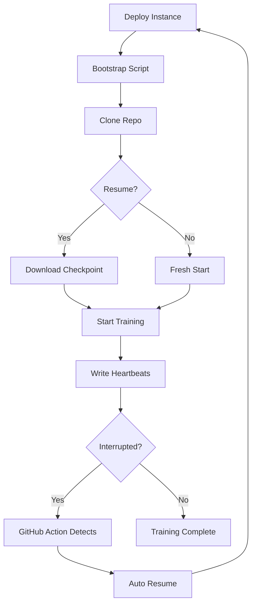

# Spot Instance Training Orchestrator

Automate weekend/overnight pre-training runs on pre-emptible GPU instances with automatic checkpoint resume after interruptions.

## 🆕 Enhanced Features (v2.0)

This orchestrator now includes advanced features for production-grade training:

- **🎯 Smart Cost Optimization**: Instance chaining, off-peak scheduling, and intelligent instance selection
- **🔔 Multi-Channel Alerts**: Slack, Discord, and email notifications for all training events  
- **📊 Real-Time Monitoring**: CloudWatch metrics, cost tracking, and performance analytics
- **🖥️ Web Dashboard**: Beautiful Streamlit interface for visual management and monitoring
- **📈 Advanced Analytics**: Historical cost analysis, usage patterns, and optimization suggestions
- **⚡ Instance Chaining**: Try multiple instance types automatically for best price/availability
- **🕰️ Scheduling Optimizer**: Recommendations for off-peak training to maximize savings

## Overview

The Spot Instance Orchestrator enables cost-effective model training by:

- **70-90% Cost Savings**: Using spot instances instead of on-demand
- **Fault Tolerance**: Automatic resume from checkpoints after interruptions
- **Budget Control**: Daily spending limits with automatic shutdown
- **Multi-Provider**: Support for AWS EC2 and RunPod
- **Monitoring**: Heartbeat tracking with auto-recovery
- **Intelligence**: Advanced cost optimization and alerting

## Quick Start

### Prerequisites

1. **AWS Account** with appropriate permissions (or RunPod API key)
2. **S3 Bucket** for checkpoint storage
3. **Python 3.8+** with pip
4. **SSH Key Pair** for instance access

### Installation

```bash
# Install the CLI tool
pip install -r scripts/requirements-spotctl.txt

# Or install manually
pip install boto3 click httpx rich
```

### Basic Usage

#### Deploy a Spot Instance

```bash
# Deploy with default settings (p4d.24xlarge @ $10/hour max)
python scripts/spotctl.py deploy

# Deploy with custom settings
python scripts/spotctl.py deploy \
    --instance-type g5.2xlarge \
    --max-price 3.0 \
    --provider aws

# Deploy with RunPod
export RUNPOD_API_KEY=your_api_key
python scripts/spotctl.py deploy \
    --instance-type RTX_A5000 \
    --max-price 1.5 \
    --provider runpod
```

#### Check Status

```bash
python scripts/spotctl.py status

# Example output:
┏━━━━━━━━━━━━━┳━━━━━━━━━━━━━━━━━━┓
┃ Property    ┃ Value            ┃
┡━━━━━━━━━━━━━╇━━━━━━━━━━━━━━━━━━┩
│ Instance    │ sir-12345678     │
│ State       │ running          │
│ Public IP   │ 54.123.45.67     │
│ Uptime      │ 2.5 hours        │
│ Cost        │ $7.50            │
└─────────────┴──────────────────┘

Daily spend: $25.00 [✓ Under budget]
```

#### Resume from Checkpoint

```bash
# Resume from the latest checkpoint
python scripts/spotctl.py deploy \
    --resume \
    --checkpoint s3://training-checkpoints/runs/run_123/checkpoint-500/shards/checkpoint.json
```

#### Tail Training Logs

```bash
python scripts/spotctl.py tail-logs --lines 100
```

#### Terminate Instance

```bash
python scripts/spotctl.py terminate
```

## 🚀 Enhanced Features Usage

### Cost Optimization Commands

#### Get Optimization Suggestions
```bash
# Get cost optimization recommendations
python scripts/spotctl.py optimize \
    --training-hours 8 \
    --min-gpu-memory 16 \
    --max-budget 50.0

# Example output:
💡 Recommended Instance: p3.2xlarge
Provider: aws
Max Price: $3.00/hour

📅 Scheduling Recommendation:
Strategy: single_session
Estimated Savings: 30-50%
Next optimal start: 2024-01-15 22:00 UTC
```

#### Deploy with Advanced Features
```bash
# Deploy with instance chaining (try multiple types for best price)
python scripts/spotctl.py deploy --use-chaining

# Deploy with cost optimizer (automatically select best instance)
python scripts/spotctl.py deploy --use-optimizer

# Combine both features
python scripts/spotctl.py deploy --use-chaining --use-optimizer
```

### Monitoring and Analytics

#### View Metrics Dashboard
```bash
# View cost metrics and analytics
python scripts/spotctl.py metrics --days 7

# Example output:
📊 Cost Metrics
┏━━━━━━━━━━━━━━━━━┳━━━━━━━━━━━━━━━━━━┓
┃ Metric          ┃ Value            ┃
┡━━━━━━━━━━━━━━━━━╇━━━━━━━━━━━━━━━━━━┩
│ Today's Spend   │ $25.50           │
│ Daily Budget    │ $100.00          │
│ Budget Remaining│ $74.50           │
│ Budget Usage    │ 25.5%            │
└─────────────────┴──────────────────┘
```

#### Detailed Analytics
```bash
# View comprehensive cost analytics
python scripts/spotctl.py analytics --days 30

# Get optimization suggestions based on usage patterns
```

### Alert System

#### Test Alerts
```bash
# Test all configured alert channels
python scripts/spotctl.py test-alerts \
    --type success \
    --message "Training completed successfully!"

# Configured channels: Slack, Discord
✅ Test success alert sent!
```

#### Configure Alert Channels
```bash
# Set up Slack notifications
export SLACK_WEBHOOK_URL=https://hooks.slack.com/services/...

# Set up Discord notifications  
export DISCORD_WEBHOOK_URL=https://discord.com/api/webhooks/...

# Set up email notifications
export SMTP_SERVER=smtp.gmail.com
export SMTP_PORT=587
export EMAIL_USER=your-email@gmail.com
export EMAIL_PASSWORD=your-app-password
export EMAIL_TO=notifications@yourcompany.com
```

### Web Dashboard

#### Launch the Dashboard
```bash
# Start the Streamlit web dashboard
streamlit run scripts/spot_dashboard.py

# Dashboard features:
# - 📊 Real-time instance monitoring
# - 💰 Cost analytics and budget tracking
# - 🎯 Cost optimization recommendations
# - 🚀 One-click instance deployment
# - 📋 Live training log streaming
```

The dashboard provides:
- **Overview Tab**: Instance status, uptime, costs, timeline
- **Cost Analytics Tab**: Budget tracking, spending breakdown, alerts
- **Optimization Tab**: Instance recommendations, scheduling suggestions
- **Deploy Tab**: Interactive deployment with advanced options
- **Logs Tab**: Live training log streaming and downloads

### Advanced Cost Optimization

#### Instance Chaining Strategy
When using `--use-chaining`, the orchestrator will try instances in order of cost-effectiveness:

1. `p3.2xlarge` @ $3.00/hr (AWS)
2. `RTX_A4000` @ $0.40/hr (RunPod) 
3. `RTX_A5000` @ $0.60/hr (RunPod)
4. `p3.8xlarge` @ $12.00/hr (AWS)
5. `p4d.24xlarge` @ $20.00/hr (AWS)

#### Scheduling Optimization
The cost optimizer provides scheduling recommendations:

- **Off-peak hours**: 10 PM - 6 AM UTC (30-50% savings)
- **Single session**: For training ≤8 hours
- **Split sessions**: For longer training across multiple nights

#### Budget Alerts
Automatic alerts are sent when:
- Daily budget is exceeded (error alert)
- 80% of budget is used (warning alert)
- Instance runs >12 hours (cost monitoring alert)
- Training completes successfully (success alert)
- Deployment fails (error alert with details)

### Multi-Channel Alerts

#### Slack Integration
Rich notifications with:
- Color-coded messages (green/yellow/red)
- Structured fields with instance details
- Training progress updates
- Cost summaries

#### Discord Integration  
Embedded messages with:
- Training status embeds
- Cost tracking information
- Instance deployment notifications
- Failure alerts with troubleshooting tips

#### Email Integration
Professional email alerts with:
- Detailed training summaries
- Cost breakdowns
- Instance performance metrics
- Alert history and trends

## Environment Variables

Configure the orchestrator using environment variables:

```bash
# AWS Configuration
export AWS_REGION=us-east-1
export AWS_ACCESS_KEY_ID=your_key
export AWS_SECRET_ACCESS_KEY=your_secret
export AWS_KEY_NAME=training-key  # SSH key pair name

# RunPod Configuration (optional)
export RUNPOD_API_KEY=your_runpod_key

# S3 Configuration
export S3_CHECKPOINT_BUCKET=training-checkpoints
export S3_HEARTBEAT_BUCKET=training-checkpoints  # Can be same as checkpoint bucket

# Cost Control
export DAILY_BUDGET=100.0  # Maximum daily spend in USD

# Repository
export REPO_URL=https://github.com/aimerib/smollmfinetune.git
```

## Terraform Deployment

For production deployments, use the Terraform module:

### 1. Initialize Terraform

```bash
cd infra/spot_runner
terraform init
```

### 2. Create Variables File

Create `terraform.tfvars`:

```hcl
instance_type        = "p4d.24xlarge"
spot_price          = 10.0
region              = "us-east-1"
key_name            = "training-key"
s3_checkpoint_bucket = "my-training-checkpoints"
daily_budget        = 100.0
```

### 3. Deploy Infrastructure

```bash
# Plan the deployment
terraform plan

# Apply the configuration
terraform apply

# Outputs will include:
# - instance_id: Spot instance request ID
# - public_ip: Instance public IP
# - s3_bucket: Checkpoint bucket name
# - ssh_command: Command to SSH into instance
```

### 4. Destroy Resources

```bash
terraform destroy
```

## GitHub Actions Integration

The repository includes automated monitoring via GitHub Actions:

### Automatic Monitoring

The workflow runs every 15 minutes to:
1. Check heartbeat status of all running instances
2. Detect stale heartbeats (>10 minutes old)
3. Automatically resume training on new instances

### Manual Control

Trigger manual actions from GitHub:

```yaml
# Check status
gh workflow run spot-monitor.yml -f action=check

# Resume specific run
gh workflow run spot-monitor.yml -f action=resume -f run_id=run_123

# Terminate instances
gh workflow run spot-monitor.yml -f action=terminate
```

### Required Secrets

Configure these GitHub secrets:
- `AWS_ROLE_ARN`: IAM role for OIDC authentication
- `S3_CHECKPOINT_BUCKET`: S3 bucket name
- `DISCORD_WEBHOOK` (optional): For alerts

## Cost Optimization Tips

### 1. Instance Selection

| Use Case | Instance Type | Spot Price | Performance |
|----------|--------------|------------|-------------|
| Development | g4dn.xlarge | ~$0.15/hr | Good for testing |
| Small Models | g5.2xlarge | ~$0.30/hr | 24GB VRAM |
| Medium Models | p3.2xlarge | ~$0.90/hr | 16GB V100 |
| Large Models | p4d.24xlarge | ~$3-5/hr | 8x40GB A100 |

### 2. Spot Price Strategies

```bash
# Check current spot prices
aws ec2 describe-spot-price-history \
    --instance-types p4d.24xlarge \
    --start-time $(date -u -d '1 hour ago' +%Y-%m-%dT%H:%M:%S) \
    --product-descriptions "Linux/UNIX" \
    --query 'SpotPriceHistory[*].[AvailabilityZone,SpotPrice]' \
    --output table
```

### 3. Budget Management

- Set conservative daily budgets
- Use S3 lifecycle policies for old checkpoints
- Monitor CloudWatch billing alerts
- Terminate instances during peak pricing

## Architecture

### Components

1. **spotctl CLI**: Command-line interface for managing instances
2. **Bootstrap Script**: Automated setup on instance launch
3. **Heartbeat Monitor**: Tracks training health
4. **Cost Tracker**: Enforces budget limits
5. **GitHub Actions**: Automated monitoring and recovery

### Workflow



## Troubleshooting

### Common Issues

#### 1. Instance Launch Failures

```bash
# Check spot request status
aws ec2 describe-spot-instance-requests \
    --spot-instance-request-ids sir-12345678

# Common causes:
# - Insufficient spot capacity
# - Price too low
# - Invalid AMI for region
```

#### 2. SSH Connection Issues

```bash
# Ensure security group allows SSH
aws ec2 describe-security-groups \
    --group-names training-spot-instances

# Check instance public IP
python scripts/spotctl.py status
```

#### 3. Heartbeat Failures

```bash
# Check S3 permissions
aws s3 ls s3://training-checkpoints/heartbeats/

# View heartbeat logs on instance
ssh ubuntu@<instance-ip> "tail -f /var/log/heartbeat.log"
```

### Debug Mode

Enable verbose logging:

```bash
export SPOTCTL_DEBUG=1
python scripts/spotctl.py deploy
```

## Security Best Practices

1. **IAM Permissions**: Use least-privilege policies
2. **SSH Keys**: Rotate regularly, restrict access
3. **Security Groups**: Limit SSH to known IPs
4. **S3 Buckets**: Enable versioning and encryption
5. **Secrets**: Use AWS Secrets Manager or GitHub Secrets

## Advanced Usage

### Custom Bootstrap Scripts

Override the default bootstrap script:

```bash
# Create custom script
cat > my_bootstrap.sh <<'EOF'
#!/bin/bash
# Custom setup here
EOF

# Deploy with custom script
python scripts/spotctl.py deploy \
    --bootstrap-script my_bootstrap.sh
```

### Multi-Region Deployments

Deploy across regions for better availability:

```bash
# Deploy in multiple regions
for region in us-east-1 us-west-2 eu-west-1; do
    AWS_REGION=$region python scripts/spotctl.py deploy \
        --instance-type g5.2xlarge &
done
```

### Spot Fleet Management

For multiple concurrent runs:

```python
# spot_fleet.py
import subprocess
from concurrent.futures import ThreadPoolExecutor

def deploy_instance(config):
    cmd = [
        'python', 'scripts/spotctl.py', 'deploy',
        '--instance-type', config['instance_type'],
        '--max-price', str(config['max_price'])
    ]
    subprocess.run(cmd)

configs = [
    {'instance_type': 'g5.2xlarge', 'max_price': 2.0},
    {'instance_type': 'g5.4xlarge', 'max_price': 4.0},
]

with ThreadPoolExecutor(max_workers=5) as executor:
    executor.map(deploy_instance, configs)
```

## Monitoring Dashboard

Create a simple monitoring dashboard:

```python
# monitor.py
import boto3
import time
from rich.console import Console
from rich.table import Table
from rich.live import Live

def get_instance_stats():
    # Implementation to fetch instance stats
    pass

console = Console()

with Live(console=console, refresh_per_second=1) as live:
    while True:
        table = Table(title="Training Instances")
        # Add instance data to table
        live.update(table)
        time.sleep(5)
```

## Contributing

To contribute to the spot orchestrator:

1. Follow TDD principles (tests first)
2. Update documentation
3. Add integration tests
4. Submit PR with clear description

## References

- [AWS Spot Instance Best Practices](https://docs.aws.amazon.com/AWSEC2/latest/UserGuide/spot-best-practices.html)
- [RunPod API Documentation](https://docs.runpod.io/api)
- [Checkpoint Sharding Guide](checkpoint_sharding.md)
- [Training Telemetry SDK](../app/utils/telemetry_sdk/README.md) 