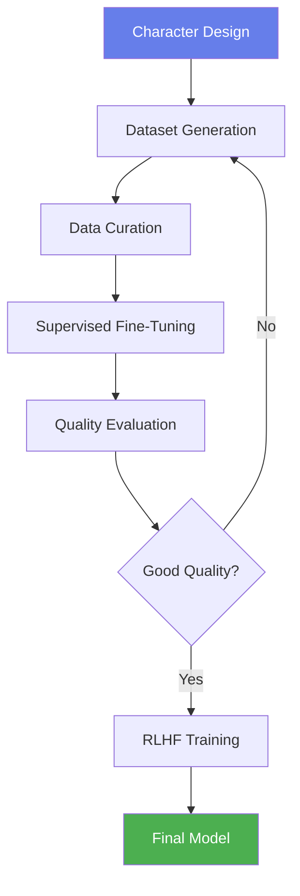

# Training Guide

This comprehensive guide covers everything you need to know about training AI characters, from dataset generation to advanced optimization techniques.

<div style={{background: 'linear-gradient(135deg, #4facfe 0%, #00f2fe 100%)', padding: '2rem', borderRadius: '12px', color: 'white', marginBottom: '2rem'}}>
  <h2 style={{marginTop: 0}}>Training Overview</h2>
  <p>Transform your character concepts into intelligent AI companions through our sophisticated training pipeline:</p>
  <ul style={{marginBottom: 0}}>
    <li>Generate high-quality conversation datasets</li>
    <li>Fine-tune language models with character personalities</li>
    <li>Optimize with reinforcement learning from human feedback</li>
    <li>Deploy production-ready character models</li>
  </ul>
</div>

## Training Pipeline Overview



## Dataset Generation

The quality of your character depends heavily on the quality of your training data. Here's how to create excellent datasets:

### Interactive Generation (Recommended)

:::tip[Why Interactive Generation?]
<div>
  <ul>
    <li>Human oversight ensures quality</li>
    <li>AI learns from your preferences</li>
    <li>Real-time character consistency checking</li>
    <li>Best balance of quality and efficiency</li>
  </ul>
</div>
:::
#### Step-by-Step Process

1. **Navigate to Dataset Studio**

2. **Configure Generation Settings**:
   ```
   Target Samples: 500-1000 (recommended)
   Quality Level: Iterative
   Batch Size: 10
   Temperature: 0.8-0.9
   ```

3. **Start Interactive Generation**:
   - Click "Generate Batch"
   - Review each generated conversation
   - Accept high-quality samples
   - Regenerate poor samples
   - The AI learns from your choices

4. **Monitor Statistics**:
   - Diversity score (aim for >0.7)
   - Character consistency (aim for >0.8)
   - Topic coverage distribution
   - Average conversation length

### Quality Guidelines

<div style={{display: 'grid', gridTemplateColumns: 'repeat(2, 1fr)', gap: '1rem', marginBottom: '2rem'}}>
  :::tip[✅ Good Training Samples]
  <div>
    <ul>
      <li>Clear demonstration of personality traits</li>
      <li>Natural, flowing conversation</li>
      <li>References to character background</li>
      <li>Consistent voice and mannerisms</li>
      <li>Varied topics and scenarios</li>
    </ul>
  </div>
  :::
  :::danger[❌ Poor Training Samples]
  <div>
    <ul>
      <li>Generic, could be any character</li>
      <li>Out-of-character responses</li>
      <li>Repetitive or boring content</li>
      <li>Factual errors about the world</li>
      <li>Inconsistent personality display</li>
    </ul>
  </div>
  :::
</div>

### Dataset Composition

For a well-rounded character, aim for this distribution:

```python
dataset_composition = {
    "casual_conversation": "30%",      # General chitchat
    "character_exposition": "20%",     # Background, goals, personality
    "world_interaction": "20%",        # References to world lore
    "emotional_scenarios": "15%",      # Different emotional states
    "conflict_resolution": "10%",      # How character handles problems
    "specialized_knowledge": "5%"      # Unique expertise or interests
}
```

### Advanced Generation Techniques

#### Scenario-Based Generation
Create specific scenarios to test character consistency:

```python
scenarios = [
    "Meeting someone new at a tavern",
    "Dealing with disappointment",
    "Sharing a personal memory",
    "Teaching their specialty",
    "Reacting to unexpected danger"
]
```

#### Personality Reinforcement
Include samples that explicitly demonstrate Big Five traits:

- **High Openness**: Curiosity about new ideas, creative solutions
- **High Conscientiousness**: Planning, organization, attention to detail
- **High Extraversion**: Seeking social interaction, enthusiasm
- **High Agreeableness**: Helping others, showing empathy
- **Low Neuroticism**: Calm under pressure, emotional stability

### Voice Generation
Our platform now includes an advanced **Character Voice System** that automatically generates a unique voice profile for each character based on their personality. This ensures that a character's voice remains consistent and is a true reflection of their traits.

- **Personality-Driven**: Voice characteristics like pitch, speaking rate, and energy are derived from the Big Five traits.
- **Control Token Ready**: The generated voice profile works seamlessly with control tokens for expressive, real-time modulation during speech synthesis.

This system is used during dataset generation to create realistic, character-aligned audio, enriching the multimodal training data.

## ⚙️ Training Configuration

### Supervised Fine-Tuning (SFT)

Navigate to **Training Config** (⚙️) to configure your training:

#### Basic Settings


```yaml
# Recommended SFT Configuration
model: "unsloth/Llama-3.2-1B"
epochs: 3                    # 2-5 depending on dataset size
learning_rate: 5e-5          # Conservative starting point
batch_size: 4                # Adjust based on GPU memory
gradient_accumulation: 4     # Effective batch size = 16
warmup_ratio: 0.1           # 10% warmup steps
weight_decay: 0.01          # Regularization
max_seq_length: 2048        # Context window
```

#### GPU Memory Optimization

For different GPU configurations:

| GPU Type | VRAM | Batch Size | Gradient Accumulation | Notes |
|----------|------|------------|-----------------------|-------|
| RTX 3060 | 12GB | 2 | 8 | Use gradient checkpointing |
| RTX 3090 | 24GB | 4 | 4 | Standard configuration |
| RTX 4090 | 24GB | 8 | 2 | Can use larger batches |
| A100 | 40GB | 16 | 1 | Maximum throughput |
| Apple M2 | 32GB | 4 | 4 | MPS acceleration |

#### Advanced Training Options

```python
# Enable for better quality
advanced_options = {
    "gradient_checkpointing": True,      # Save memory
    "mixed_precision": "fp16",           # Faster training
    "optimizer": "adamw_torch_fused",    # Optimized AdamW
    "lr_scheduler": "cosine",            # Better convergence
    "save_strategy": "steps",            # Regular checkpoints
    "eval_steps": 100,                   # Frequent evaluation
    "logging_steps": 10,                 # Detailed logs
}
```

### Reinforcement Learning from Human Feedback (RLHF)

After SFT, refine your character with preference-based training:

#### When to Use RLHF

<div style={{display: 'grid', gridTemplateColumns: 'repeat(2, 1fr)', gap: '1rem', marginBottom: '1rem'}}>
  :::tip[Use RLHF When:]
  <div>
    <ul>
      <li>You have 100+ preference pairs</li>
      <li>Character needs behavioral refinement</li>
      <li>Reducing unwanted behaviors</li>
      <li>Enhancing specific traits</li>
    </ul>
  </div>
  :::
  :::note[Skip RLHF When:]
  <div>
    <ul>
      <li>Limited preference data (&lt;100 pairs)</li>
      <li>SFT results are already excellent</li>
      <li>Time constraints exist</li>
      <li>Character is simple/straightforward</li>
    </ul>
  </div>
  :::
</div>

#### RLHF Configuration

```yaml
# GRPO (Recommended) Configuration
algorithm: "grpo"           # More stable than PPO
beta: 0.1                   # KL penalty coefficient
learning_rate: 1e-6         # Lower than SFT
epochs: 1                   # Usually 1 is enough
batch_size: 2               # Smaller batches
gradient_accumulation: 8    # Maintain effective batch size
```

## 📈 Training Monitoring

### Real-Time Dashboard

Navigate to **Training Dashboard** during training:

#### Key Metrics to Watch

:::note[Key Metrics to Watch]
1. **Training Loss**
   - Should decrease steadily
   - Plateau indicates convergence
   - Sudden spikes may indicate issues

2. **Validation Loss**
   - Should follow training loss
   - Growing gap indicates overfitting
   - Use early stopping if needed

3. **Personality Alignment**
   - Measures Big Five trait consistency
   - Target: >0.75 alignment score
   - Low scores need more personality-focused data

4. **Lore Adherence**
   - Checks world fact consistency
   - Target: >0.85 adherence score
   - Low scores need more world-integrated examples

:::

### Training Progress Indicators


### When to Stop Training

Stop training when:
- Validation loss stops improving for several hundred steps
- Personality alignment plateaus at a satisfactory level
- Training has completed planned epochs
- Character responses in preview look good

## 🔬 Quality Optimization

### Common Training Issues and Solutions

<details>
<summary><strong>Character sounds generic</strong></summary>

**Solutions:**
- Add more personality-specific training examples
- Increase samples showing unique traits/quirks
- Use control tokens to reinforce personality
- Consider higher learning rate (carefully)
</details>

<details>
<summary><strong>Overfitting (memorizing training data)</strong></summary>

**Solutions:**
- Reduce number of epochs
- Increase dataset diversity
- Add dropout or weight decay
- Use larger batch sizes
- Implement early stopping
</details>

<details>
<summary><strong>Inconsistent personality</strong></summary>

**Solutions:**
- Generate more personality-focused examples
- Use RLHF to reinforce desired behaviors
- Check for contradictory training samples
- Increase personality alignment weight
</details>

<details>
<summary><strong>Poor world knowledge</strong></summary>

**Solutions:**
- Add more world-integrated conversations
- Create factual Q&A dataset about the world
- Ensure world lore is referenced in examples
- Use structured prompts during generation
</details>

### Advanced Optimization Techniques

#### Multi-Stage Training

For complex characters, use a staged approach:

```python
training_stages = [
    {
        "stage": "Foundation",
        "focus": "Basic personality and voice",
        "epochs": 2,
        "learning_rate": 5e-5
    },
    {
        "stage": "World Integration", 
        "focus": "Lore and relationships",
        "epochs": 1,
        "learning_rate": 2e-5
    },
    {
        "stage": "Refinement",
        "focus": "Polish and consistency",
        "epochs": 1,
        "learning_rate": 1e-5
    }
]
```

#### Ensemble Training

Train multiple versions and combine:

1. Train with different random seeds
2. Vary hyperparameters slightly
3. Use different data splits
4. Ensemble the best models

## Best Practices Summary

<div style={{background: 'linear-gradient(135deg, #66bb6a 0%, #4caf50 100%)', padding: '2rem', borderRadius: '12px', color: 'white', marginBottom: '2rem'}}>
  <h3 style={{marginTop: 0}}>Golden Rules for Character Training</h3>
  <ol>
    <li><strong>Quality over Quantity</strong>: 500 excellent samples beat 2000 mediocre ones</li>
    <li><strong>Personality First</strong>: Ensure strong personality representation in data</li>
    <li><strong>Monitor Actively</strong>: Watch metrics and preview responses during training</li>
    <li><strong>Iterate Gradually</strong>: Small improvements over multiple iterations</li>
    <li><strong>Test Thoroughly</strong>: Verify character consistency across scenarios</li>
    <li><strong>Document Settings</strong>: Keep track of what works for future reference</li>
  </ol>
</div>

## Training Workflow Example

Here's a complete example workflow for training "Aria the Magical Librarian":

```bash
# 1. Generate Dataset (Dataset Studio)
- Target: 750 samples
- Method: Interactive generation
- Focus: 40% personality, 30% world knowledge, 30% general

# 2. Configure SFT Training
- Model: unsloth/Llama-3.2-1B
- Epochs: 3
- Learning rate: 5e-5
- Batch size: 4

# 3. Monitor Training
- Watch personality alignment (achieved: 0.82)
- Check lore adherence (achieved: 0.91)
- Preview responses every 100 steps

# 4. Optional RLHF
- Generated 150 preference pairs during testing
- GRPO training for 1 epoch
- Beta: 0.1

# 5. Final Evaluation
- Test across 20 diverse scenarios
- Personality drift analysis: <5% drift
- Ready for production!
```

## Exporting Trained Models

After successful training:

1. **Test Thoroughly** in Model Testing interface
2. **Run Final Evaluations** for quality metrics
3. **Export Runtime Packet** with trained adapter
4. **Deploy to Production** via inference engine

## Next Steps

Your character is trained! Now:

1. **[Client Guide](./client-guide)** - Test your character in the beautiful React client
2. **[Advanced Features](./advanced-features)** - Explore control tokens and advanced techniques

---
:::tip[Congratulations!]
<div>
  <p>You now have the knowledge to train compelling AI characters. Time to bring your creations to life!</p>
  <a href="./client-guide" style={{background: 'linear-gradient(135deg, #667eea 0%, #764ba2 100%)', color: 'white', padding: '0.75rem 2rem', borderRadius: '25px', textDecoration: 'none', display: 'inline-block', marginTop: '1rem'}}>
    <span style={{fontSize: '1.2rem'}}>Test Your Character →</span> 
  </a>
  </div> 
:::